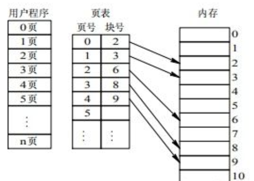
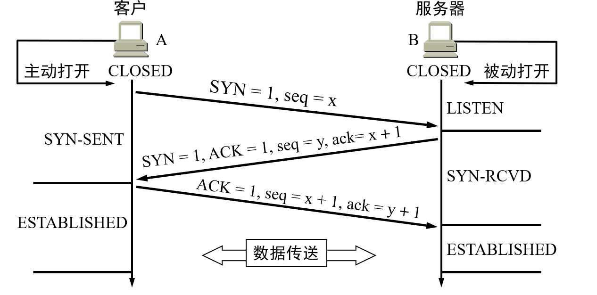
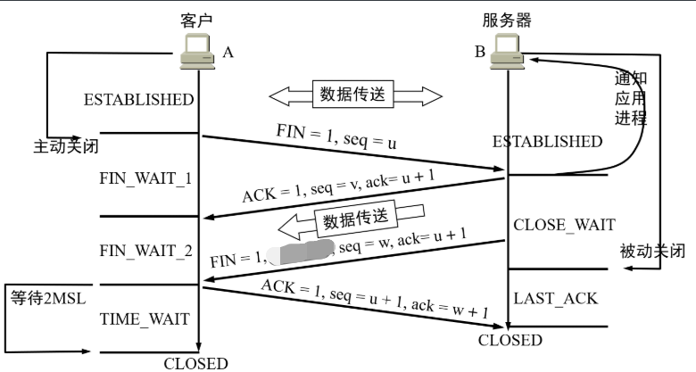

# Java ⭐⭐⭐⭐⭐
## 语言基础
### 1. Java中的几种基本数据类型是什么，各占用多少字节。
### 2. String类能够被继承吗，为什么。
### 3. Stirng，StringBuffer，StringBuilder的区别。
### 4. ArrayList和LinkedList有什么区别。
### 5. 讲一下类的实例化顺序，比如父类静态数据，构造函数，字段，子类静态数据，构造函数，字段，当new的时候，他们的执行顺序。
### 6. 用过哪些Map类，都有什么区别。
### 7. HashMap是线程安全的吗，并发下使用的Map是什么。他们的内部原理分别是什么，比如存储方式，hashcode，扩容，默认容量等。能否手写实现一个Hashmap？ ⭐⭐⭐⭐⭐⭐

重新认识Hashmap：https://tech.meituan.com/2016/06/24/java-hashmap.html

Java HashMap工作原理及实现：[https://yikun.github.io/2015/04/01/Java-HashMap%E5%B7%A5%E4%BD%9C%E5%8E%9F%E7%90%86%E5%8F%8A%E5%AE%9E%E7%8E%B0/](https://yikun.github.io/2015/04/01/Java-HashMap工作原理及实现/)

```

```


编程实现：手写实现hashmap

https://blog.csdn.net/huangshulang1234/article/details/79713303


### 8. Java8的CocurrentHashMap为什么放弃了分段锁，有什么问题吗。如果你来设计，你如何设计。
### 9. 有没有顺序的Map实现类，如果有，他们是怎么保证有序的。
### 10. 抽象类和接口的区别，类可以继承多个类吗，接口可以继承多个接口吗，类可以实现多个接口吗。
### 11. 继承和聚合的区别是什么。
### 12. 反射的原理，反射创建类实例的三种方式是什么。
### 13. 反射中，Class.forName和ClassLoader的区别。
### 14. 描述动态代理的几种实现方式，分别说出相应的优缺点。 ⭐⭐⭐⭐

静态代理是Java中的一种设计模式。

动态代理的两种方式：https://www.jianshu.com/p/3caa0c23a157

```
动态代理和静态代理的区别：
普通代理模式，代理类Proxy的Java代码在JVM运行时就已经确定了，也就是在编码编译阶段就确定了Proxy类的代码。而动态代理是指在JVM运行过程中，动态的创建一个类的代理类，并实例化代理对象。因为实际的代理类是在运行时创建的。

(1)JDK动态代理方式
从类的结构可以看出，JDK动态生成代理类，一定要被代理类实现了某个接口，否则就无法生成代理类，这也就是JDK动态代理的缺陷之一。
另外，被代理类可以实现多个接口。从代理类代码中可以看到，代理类是通过InvocationHandler的invoke方法去实现被代理接口方法调用的。所以被代理对象实现了多个接口并且希望对不同接口实施不同的代理行为时，应该在ConcreteInvocationHandler类的invoke方法中，通过判断方法名来实现不同的接口的代理行为。


```


### 15. 为什么CGlib方式可以对接口实现代理。
### 16. final关键词的作用。
### 17. static关键词的作用。
### 18. 写出三种单例模式。
### 19. 如何在父类中为子类自动完成所有的hashcode和equals实现，这么做有何优劣。
### 20. 请结合OO设计理念，谈谈访问修饰符public、private、protected、default在应用中的设计。
### 21. 深拷贝和浅拷贝的区别。
### 22. 请枚举出5个运行时异常。
### 23. 在自己的代码中，如果创建一个java.lang.String类，这个类是否可以被类加载器加载，为什么。
### 24. 说一说你对java.lang.Object对象中的hashCode和equals方法的理解。在什么场景下需要重新实现这两个方法。⭐⭐⭐

```

```


### 25. 在JDK1.5中，引入了泛型，泛型的存在是用来解决什么问题。
### 26. 有没有可能2个不相等的对象有相同的hashcode。
### 27. 什么是序列化，什么是反序列化，反序列化会遇到什么问题，如何解决。
### 28. Java8的新特性。
### 29. 面向对象的三大特性，Java中实现多态的方式。
### 30. 抽象类和接口的相同点和不同点。
### 31. 谈一谈Java中的四种引用。
### 
###

### 


## I/O
### 1. IO模型有哪些，讲讲你理解的NIO，它和BIO，AIO的区别是啥。
### 2. 讲一下Reactor模型。
### 3. 同步阻塞、同步非阻塞、异步的区别。
### 4. select、poll、eopll 的区别。

## JVM
### 1. JVM内存的构成。⭐⭐⭐⭐⭐

```

```


### 2. Java中堆和栈的区别。
### 3. 谈一谈GC回收算法。
### 4. MinorGC和FullGC区别。
### 5. GC垃圾回收器有哪些，区别。⭐⭐⭐⭐

```

```


### 6. MS GC 回收分为哪几个阶段，分别做了什么事情。
### 7. CMS 有哪些重要参数。
### 8. Concurrent Model Failure 和 ParNew promotion failed 什么情况下会发生。
### 9. CMS 的优缺点。
### 10. 有做过哪些 GC 调优。
### 11. 为什么要划分成年轻代和老年代。
### 12. 年轻代为什么被划分成 eden、survivor 区域。
### 13. 年轻代为什么采用的是复制算法。
### 14. 老年代为什么采用的是标记清除、标记整理算法。
### 15.什么情况下使用堆外内存，要注意些什么。
### 16. 堆外内存如何被回收。

## 多线程

(1)多线程的各种概念是相互交叉的，比如线程的状态转换和关键词（wait notify synchronized有关），又同时和操作系统中CPU的切换有关，要形成知识系统。

### 1. volatile关键词的作用。⭐⭐⭐⭐

```
被volatile修饰的共享变量，就会具有以下两个特性：
1. 保证了不同线程对该变量操作的内存可见性。
2. 禁止指令重排序。
```

这个要是说起来可就多了，我就从Java内存模型开始说起吧。Java虚拟机规范试图定义一个Java内存模型(JMM)，以屏蔽所有类型的硬件和操作系统内存访问差异，让Java程序在不同的平台上能够达到一致的内存访问效果。简单地说，由于CPU执行指令的速度很快，但是内存访问速度很慢，差异不是一个量级，所以搞处理器的那群大佬们又在CPU里加了好几层高速缓存。

在Java内存模型中，对上述优化进行了一波抽象。JMM规定所有的变量都在主内存中，类似于上面提到的普通内存，每个线程又包含自己的工作内存，为了便于理解可以看成CPU上的寄存器或者高速缓存。因此，线程的操作都是以工作内存为主，它们只能访问自己的工作内存，并且在工作之前和之后，该值被同步回主内存。

并发编程的三个特点：

（1）原子性：即一个操作或者多个操作 要么全部执行并且执行的过程不会被任何因素打断，要么就都不执行。

（2）可见性：指当多个线程访问同一个变量时，一个线程修改了这个变量的值，其他线程能够立即看得到修改的值。

（3）有序性：即程序执行的顺序按照代码的先后顺序执行。

### 2. Java里的线程有哪些状态,状态之间如何进行转换？⭐⭐⭐

```
Java线程的生命周期中，存在几种状态。在Thread类里有一个枚举类型State，定义了线程的几种状态，分别有：

NEW: 线程创建之后，但是还没有启动(not yet started)。这时候它的状态就是NEW

RUNNABLE: 正在Java虚拟机下跑任务的线程的状态。在RUNNABLE状态下的线程可能会处于等待状态， 因为它正在等待一些系统资源的释放，比如IO

BLOCKED: 阻塞状态，等待锁的释放，比如线程A进入了一个synchronized方法，线程B也想进入这个方法，但是这个方法的锁已经被线程A获取了，这个时候线程B就处于BLOCKED状态(比较常见)

WAITING: 等待状态，处于等待状态的线程是由于执行了3个方法中的任意方法。 1. Object的wait方法，并且没有使用timeout参数; 2. Thread的join方法，没有使用timeout参数 3. LockSupport的park方法。 处于waiting状态的线程会等待另外一个线程处理特殊的行为。 再举个例子，如果一个线程调用了一个对象的wait方法，那么这个线程就会处于waiting状态直到另外一个线程调用这个对象的notify或者notifyAll方法后才会解除这个状态

TIMED_WAITING: 有等待时间的等待状态，比如调用了以下几个方法中的任意方法，并且指定了等待时间，线程就会处于这个状态。 1. Thread.sleep方法 2. Object的wait方法，带有时间 3. Thread.join方法，带有时间 4. LockSupport的parkNanos方法，带有时间 5. LockSupport的parkUntil方法，带有时间

TERMINATED: 线程中止的状态，这个线程已经完整地执行了它的任务
```


### 3. 乐观锁和悲观锁的区别。⭐⭐⭐⭐⭐

悲观锁：synchronized和ReentranLock

```
总是假设最坏的情况，每次去拿数据的时候都认为别人会修改，所以每次在拿数据的时候都会上锁，这样别人想拿这个数据就会阻塞直到它拿到锁（共享资源每次只给一个线程使用，其它线程阻塞，用完后再把资源转让给其它线程）。传统的关系型数据库里边就用到了很多这种锁机制，比如行锁，表锁等，读锁，写锁等，都是在做操作之前先上锁。Java中synchronized和ReentrantLock等独占锁就是悲观锁思想的实现。
```


乐观锁：版本控制机制和CAS算法

**CAS** 

应用场景：JUC.atomic包

```
compare and swap（比较与交换），是一种有名的无锁算法。无锁编程，即不使用锁的情况下实现多线程之间的变量同步，也就是在没有线程被阻塞的情况下实现变量的同步，所以也叫非阻塞同步（Non-blocking Synchronization）。CAS算法涉及到三个操作数

需要读写的内存值 V
进行比较的值 A
拟写入的新值 B

当且仅当 V 的值等于 A时，CAS通过原子方式用新值B来更新V的值，否则不会执行任何操作（比较和替换是一个原子操作）。一般情况下是一个自旋操作，即不断的重试。
```

缺点：

```
CPU性能开销：如果一个线程不断尝试修改值，都没有成功，计算造成的开销
ABA问题：
如果一个变量V初次读取的时候是A值，并且在准备赋值的时候检查到它仍然是A值，那我们就能说明它的值没有被其他线程修改过了吗？很明显是不能的，因为在这段时间它的值可能被改为其他值，然后又改回A，那CAS操作就会误认为它从来没有被修改过。这个问题被称为CAS操作的 "ABA"问题。
```

synchronized和CAS乐观锁的比较：**单的来说CAS适用于写比较少的情况下（多读场景，冲突一般较少），synchronized适用于写比较多的情况下（多写场景，冲突一般较多）**

对于资源竞争较少（线程冲突较轻）的情况，使用synchronized同步锁进行线程阻塞和唤醒切换以及用户态内核态间的切换操作额外浪费消耗cpu资源；而CAS基于硬件实现，不需要进入内核，不需要切换线程，操作自旋几率较少，因此可以获得更高的性能。

对于资源竞争严重（线程冲突严重）的情况，CAS自旋的概率会比较大，从而浪费更多的CPU资源，效率低于synchronized。

### 4. JUC包（Java.util.Concurrent）⭐⭐⭐⭐⭐

```

```

#### 1. synchronized

```

```


#### 2. reentrantlock

```

```


#### 3. AQS

```

```


源码分析：https://www.javadoop.com/post/AbstractQueuedSynchronizer

#### 4. ConcurrentHashMap

```

```


### 5. Java中有哪些锁？⭐⭐⭐⭐

美团技术文章：https://tech.meituan.com/2018/11/15/java-lock.html（Java中的锁）

- 按照特性有不同的划分规则，同一个锁可能会有多种特性，比如ReentrantLock是悲观锁、0非公平锁（默认）、可重入锁、独享锁。
- AQS的应用比较广泛 


（1）自旋锁：

```
阻塞或唤醒一个Java线程需要操作系统切换CPU状态来完成，这种状态转换需要耗费处理器时间。如果同步代码块中的内容过于简单，状态转换消耗的时间有可能比用户代码执行的时间还要长。

在许多场景中，同步资源的锁定时间很短，为了这一小段时间去切换线程，线程挂起和恢复现场的花费可能会让系统得不偿失。如果物理机器有多个处理器，能够让两个或以上的线程同时并行执行，我们就可以让后面那个请求锁的线程不放弃CPU的执行时间，看看持有锁的线程是否很快就会释放锁。

而为了让当前线程“稍等一下”，我们需让当前线程进行自旋，如果在自旋完成后前面锁定同步资源的线程已经释放了锁，那么当前线程就可以不必阻塞而是直接获取同步资源，从而避免切换线程的开销。这就是自旋锁。
```


应用场景：CAS（java.util.concurrent.atomicInteger）重新尝试更新值的过程

（2）公平锁&非公平锁

```
公平锁是指多个线程按照申请锁的顺序来获取锁，线程直接进入队列中排队，队列中的第一个线程才能获得锁。公平锁的优点是等待锁的线程不会饿死。缺点是整体吞吐效率相对非公平锁要低，等待队列中除第一个线程以外的所有线程都会阻塞，CPU唤醒阻塞线程的开销比非公平锁大。
```

应用场景：ReentrantLock默认是非公平锁，可以通过构造方法实现非公平锁。

（3）重入锁&非重入锁

```
可重入锁又名递归锁，是指在同一个线程在外层方法获取锁的时候，再进入该线程的内层方法会自动获取锁（前提锁对象得是同一个对象或者class），不会因为之前已经获取过还没释放而阻塞。Java中ReentrantLock和synchronized都是可重入锁，可重入锁的一个优点是可一定程度避免死锁。
```

```java
public class Widget {
    public synchronized void doSomething() {
        System.out.println("方法1执行...");
        doOthers();
    }

    public synchronized void doOthers() {
        System.out.println("方法2执行...");
    }
}
```

（4）独享锁&共享锁

```
对于Java ReentrantLock而言，其是独享锁。但是对于Lock的另一个实现类ReadWriteLock，其读锁是共享锁，其写锁是独享锁。
　　 读锁的共享锁可保证并发读是非常高效的，读写，写读 ，写写的过程是互斥的。
　　 独享锁与共享锁也是通过AQS来实现的，通过实现不同的方法，来实现独享或者共享。
```


### 6. 多线程关键词 ⭐⭐⭐⭐⭐

#### 1. wait notify notifyAll

#### 2. sleep

#### 3. join


----


### 3. Runnable和Thread的比较。

### 4. Thread类的start()和run()方法有啥区别。
### 5. Runnbale和Callable有啥不同。
### 6. 线程安全的定义是什么。Vector是线程安全类吗。
### 7. 谈一谈Java中的竞态条件。
### 8. Java中如何停止一个线程。

```

```


### 9. 一个线程运行时发生异常会怎么。
### 


https://tech.meituan.com/2018/11/15/java-lock.html——美团技术团队的锁的总结

### 12. 如何实现一个乐观锁。
### 13. AQS是如何唤醒下一个线程的。
### 14. ReentrantLock如何实现公平和非公平锁。
### 15. CountDownLatch和CyclicBarrier的区别。各自适用于什么场景。
### 16. 什么是ThreadLocal，以及使用时需要注意什么，比如内存泄漏。
### 17. 说一说往线程池中提交一个任务会发生什么。
### 18. 线程池几个参数如何设置。
### 19. 线程池的非核心线程什么时候会被释放。
### 20. 如何排查死锁。
### 21. 如何在两个线程间共享数据。
### 22. notify和notifyAll有什么区别。
### 23. 为什么wait，notify，notifyAll这些方法不在Thread类里面。
### 24. 什么是FutureTask。
### 25. interrupted和isInterrupted方法有啥区别。
### 26. 为什么wait和notify方法要在同步块中使用。
### 27. 为什么应该在循环中检查等待条件。
### 28. Java中的同步集合和并发集合有什么区别。
### 29. 什么是线程池，为什么要使用线程池。
### 30. 请你实现一个生产者——消费者模型。
### 31. Java里面的活锁和死锁有什么区别。
### 32. 如何检查一个线程是否持有锁。
### 33. 在Java中，如何获取线程堆栈。
### 34. 有三个线程t1,t2,t3，如何确保它们的执行顺序。
### 35. 谈一塔Semaphore类。
### 36. ConcurrentHashMap的并发度是什么。
### 37. 你往线程池中提交任务时候，如果线程队列已经满了，会发生什么。
### 38. submit()和execute()方法的区别。
### 39. Swing是线程安全的吗。
### 40. invokeAndWait和invokeLater有什么区别。
### 41. Swing API中哪些方法是线程安全的。
### 42. 如何创建Immutable对象。
### 43. ReadWriteLock类是什么。
### 44. 多线程中的忙循环。
### 45. 如何强制启动一个线程。
### 46. wait()和sleep()方法有啥不同。
### 47. 说出3条你遵循的多线程的最佳实践。
## I/O

### 1. IO模型有哪些，讲讲你理解的NIO，它和BIO，AIO的区别是啥。

### 2. 讲一下Reactor模型。

### 3. 同步阻塞、同步非阻塞、异步的区别。

### 4. select、poll、eopll 的区别。

## JDK8

函数式编程：

我们最常用的面向对象编程（Java）属于**命令式编程**（Imperative Programming）这种编程范式。常见的编程范式还有**逻辑式编程**（Logic Programming），**函数式编程**（Functional Programming）。

函数式编程作为一种编程范式，在科学领域，是一种编写计算机程序数据结构和元素的方式，它把计算过程当做是数学函数的求值，而避免更改状态和可变数据。

- 函数式编程带来的好处尤为明显。这种代码更多地表达了业务逻辑的意图，而不是它的实现机制。易读的代码也易于维护、更可靠、更不容易出错。【类似于框架的作用】

### 1. lambda表达式⭐⭐⭐⭐

使用Java 8 Lambda表达式可以实现更高的效率。通过使用具有多核的CPU，用户可以通过使用lambda并行处理集合来利用多核CPU。

```java
        Arrays.asList("a","v","e").forEach(e -> {
            System.out.println(e);
            System.out.println("---");
        });
```

### 2.  函数式接口⭐⭐

函数式接口(Functional Interface)就是一个有且仅有一个抽象方法，但是可以有多个非抽象方法的接口。

```java
@FunctionalInterface
interface  GreetingService{
    //只能有这一个抽象方法
    void sayMessage(String message);
}

public class _funcitonalInterface {

    public static void main(String[] args) {
        //代替匿名内部类
        GreetingService greetingService = message -> {
            System.out.println("get msg :" + message);
        };

        greetingService.sayMessage("gee");
    }
}
```

Consumer

Function

Predicate

### 3. Stream流操作 ⭐⭐⭐⭐

流支持并行操作，而迭代器，for循环都是串行操作，所以流在多核处理上有强大优势。

主要是对于集合类的操作：stream是对集合对象功能的增强，它专注于对集合对象进行各种非常便利、高效的聚合操作，或者大批量数据操作。

应用场景：只要给出需要对其包含的元素执行什么操作，比如 “过滤掉长度大于 10 的字符串”、“获取每个字符串的首字母”等，Stream 会隐式地在内部进行遍历，做出相应的数据转换。

```java
        List<Person> collect = res
                .stream()
                .filter(person -> {
                    if("男".equals(person.getSex()) && person.getAge() < 22)
                        return true;
                    return false;
                })
                .collect(Collectors.toList());

        System.out.println(collect);
```

https://www.jianshu.com/p/9fe8632d0bc2 关于Stream的实际应用

主要是Filter和Map的使用


# 操作系统
### 1. 进程和线程的区别是什么 ⭐⭐⭐⭐⭐

(1)CPU资源开销

(2)通信方式

```
进程是资源分配的最小单位，线程是程序执行的最小单位。

进程有自己的独立地址空间，每启动一个进程，系统就会为它分配地址空间，建立数据表来维护代码段、堆栈段和数据段，这种操作非常昂贵。而线程是共享进程中的数据的，使用相同的地址空间，因此CPU切换一个线程的花费远比进程要小很多，同时创建一个线程的开销也比进程要小很多。

线程之间的通信更方便，同一进程下的线程共享全局变量、静态变量等数据，而进程之间的通信需要以通信的方式（IPC)进行。不过如何处理好同步与互斥是编写多线程程序的难点。

但是多进程程序更健壮，多线程程序只要有一个线程死掉，整个进程也死掉了，而一个进程死掉并不会对另外一个进程造成影响，因为进程有自己独立的地址空间。
```

### 2. 什么是操作系统的用户态，什么是操作系统的内核态？之间如何转换⭐⭐⭐⭐⭐

(1)为什么要区分用户态和内核态？

```
在计算机系统中，通常运行着两类程序：系统程序和应用程序，为了保证系统程序不被应用程序有意或无意地破坏，为计算机设置了两种状态：

系统态(也称为管态或核心态)，操作系统在系统态运行——运行操作系统程序
用户态(也称为目态)，应用程序只能在用户态运行——运行用户程序
在实际运行过程中，处理机会在系统态和用户态间切换。相应地，现代多数操作系统将 CPU 的指令集分为特权指令和非特权指令两类。

1) 特权指令——在系统态时运行的指令
对内存空间的访问范围基本不受限制，不仅能访问用户存储空间，也能访问系统存储空间，
特权指令只允许操作系统使用，不允许应用程序使用，否则会引起系统混乱。

2) 非特权指令——在用户态时运行的指令
一般应用程序所使用的都是非特权指令，它只能完成一般性的操作和任务，不能对系统中的硬件和软件直接进行访问，其对内存的访问范围也局限于用户空间。
```

- **用户态**切换到**内核态**的**唯一**途径——>**中断/异常/陷入**
- **内核态**切换到**用户态**的途径——>设置程序状态字

**注意一条特殊的指令——陷入指令（又称为访管指令**，因为内核态也被称为管理态，访管就是访问管理态）该指令给用户提供接口，用于调用操作系统的服务。

### 3. 什么是中断 ⭐⭐⭐⭐

还是老问题，为什么在操作系统中设计了中断的概念？为了提高并发执行的效率。

```
CPU中断正在运行的程序，转到处理中断事件程序
```


关于中断概念的解释：http://www.kerneltravel.net/journal/viii/01.htm

### 4. 什么是系统调用 ⭐⭐⭐⭐

定义：系统调用是linux内核中设置了一组用于实现系统功能的子程序。（位于操作系统内核的函数）

```
系统调用和普通库函数调用非常相似，只是系统调用由操作系统核心提供，运行于核心态，而普通的函数调用由函数库或用户自己提供，运行于用户态。
```

### 5. 什么死锁，死锁的条件有哪些？⭐⭐⭐⭐

```
由于系统中存在一些不可剥夺资源，而当两个或两个以上的进程占有自身资源，并请求对方资源时，会导致每个进程都无法向前推进，这就是死锁。死锁产生的必要条件有四个：互斥条件、不可剥夺条件、请求与保持条件、循环等待条件。

互斥条件指进程要求分配的资源是排他性的，即最多只能同时给一个进程使用。
不剥夺条件是指进程在使用资源完毕之前，资源不能被强行夺走。
请求并保持条件是指进程占有自身本来拥有的资源并要求其他资源。
循环等待条件是指存在一种进程资源的循环等待链。
```

### 6. 进程之间有哪些通信方式 ⭐⭐⭐⭐⭐

(1)管道

(2)消息队列

(3)共享内存

```
1.管道（pipe）及有名管道（named pipe）：
匿名管道( pipe )：管道是一种半双工的通信方式，数据只能单向流动，而且只能在具有亲缘关系的进程间使用。进程的亲缘关系通常是指父子进程关系。

通过匿名管道实现进程间通信的步骤如下：
父进程创建管道，得到两个⽂件描述符指向管道的两端
父进程fork出子进程，⼦进程也有两个⽂件描述符指向同⼀管道。
父进程关闭fd[0],子进程关闭fd[1]，即⽗进程关闭管道读端,⼦进程关闭管道写端（因为管道只支持单向通信）。⽗进程可以往管道⾥写,⼦进程可以从管道⾥读,管道是⽤环形队列实现的,数据从写端流⼊从读端流出,这样就实现了进程间通信。

2.信号（signal）：
信号是在软件层次上对中断机制的一种模拟，它是比较复杂的通信方式，用于通知进程有某事件发生，一个进程收到一个信号与处理器收到一个中断请求效果上可以说是一致的。

3.消息队列（message queue）：
消息队列是消息的链接表，它克服了上两种通信方式中信号量有限的缺点，具有写权限得进程可以按照一定得规则向消息队列中添加新信息；对消息队列有读权限得进程则可以从消息队列中读取信息。

4.共享内存（shared memory）：
可以说这是最有用的进程间通信方式。它使得多个进程可以访问同一块内存空间，不同进程可以及时看到对方进程中对共享内存中数据得更新。这种方式需要依靠某种同步操作，如互斥锁和信号量等。

5.信号量（semaphore）：
主要作为进程之间及同一种进程的不同线程之间得同步和互斥手段。

6.套接字（socket）；
这是一种更为一般得进程间通信机制，它可用于网络中不同机器之间的进程间通信，应用非常广泛。
```

### 7. 什么是缺页中断？⭐⭐⭐⭐⭐

```
在请求分页系统中，可以通过查询页表中的状态位来确定所要访问的页面是否存在于内存中。每当所要访问的页面不在内存时，会产生一次缺页中断，此时操作系统会根据页表中的外存地址在外存中找到所缺的一页，将其调入内存。 
　　缺页本身是一种中断，与一般的中断一样，需要经过4个处理步骤： 
　　1. 保护CPU现场 
　　2. 分析中断原因 
　　3. 转入缺页中断处理程序进行处理 
　　4. 恢复CPU现场，继续执行 
```


关于缺页中断的实践：https://liam.page/2017/09/01/page-fault/

### 8. 枚举一下常见的（缺页中断）页面置换算法⭐⭐⭐

**FIFO算法**

**LRU算法**

```
置换最近一段时间以来最长时间未访问过的页面。根据程序局部性原理，刚被访问的页面，可能马上又要被访问；而较长时间内没有被访问的页面，可能最近不会被访问。 
```

LRU算法计算的精髓在于根据（1）当前物理块中的内容 （2）前面计算序列访问了哪些物理块

### 9. 谈一谈fork()函数 ⭐⭐⭐⭐

```
在fork函数执行完毕后，如果创建新进程成功，则出现两个进程，一个是子进程，一个是父进程。在子进程中，fork函数返回0，在父进程中，fork返回新创建子进程的进程ID。我们可以通过fork返回的值来判断当前进程是子进程还是父进程。fork调用的一个奇妙之处就是它仅仅被调用一次，却能够返回两次，它可能有三种不同的返回值：
    1）在父进程中，fork返回新创建子进程的进程ID；
    2）在子进程中，fork返回0；
    3）如果出现错误，fork返回一个负值；
```

### 10. 页式内存管理中，怎样从逻辑地址，计算物理地址？⭐⭐

```
分页机制的思想是:通过映射，可以使连续的线性地址与物理地址相关联，逻辑上连续的线性地址对应的物理地址可以不连续。 分页的作用 - 将线性地址转换为物理地址 - 用大小相同的页替换大小不同的段。

逻辑地址 = 页号 + 页内偏移量
取到页号之后，查询页表，得到块号，然后在内存中通过块号&页内偏移量得到最终的物理地址
```




---


### 2. 什么是进程同步。
### 3. 进程间的通信方式有哪些。
### 4. 什么是上下文切换。
### 5. 进程有哪些状态， 如何转换。
### 6. 线程有哪些状态，如何转换。
### 7. 进程调度算法。
### 8. 死锁的条件，如何处理死锁。
### 9. 分析一个C程序从开始运行到结束的完整过程。
### 10. 什么是虚拟内存，优缺点。
### 11. 页式内存管理和段式内存管理的区别。
### 12. 页面置换算法有哪些，为什么要进行页面置换。
### 13. 实现一个LRU算法（经典）
### 14. 

### 15. 什么是系统调用。⭐⭐⭐⭐

```

```


### 16. Linux下启动的第一个进程是什么。
### 17. fork函数的作用，返回值是什么。
### 18. 系统调用和库函数的区别。
### 19. 编译性语言和解释性语言的区别
```
解释性语言的程序不要编译，省了道工序，解释性语言在运行程序的时候才翻译，比如解释性Java语言，专门有一个解释器可以直接执行Java程序,每一个语句都是执行的时候才能翻译。这样解释性语言每执行一次要翻译一次，效率表较低。

编译型就是编译的时候直接编译成机器可以执行的（.exe .dll .ocx）,编译和执行是分开的，但是不能跨平台。例如Delphi,C++,ASM,C是直接变异成exe文件并且自带条件编译功能。比如exe文件，以后要运行的话就不用重新编译了，直接使用编译的结果就行了（exe文件），因为翻译只做了一次，运行的时不要翻译，所以编译型语言的程序执行效率高。

编译性语言运行速度更快
```


# 计算机网络
### 1. 谈一谈OSI七层模型和TCP/IP五层模型。

```

```


### 2. IP地址的分类。
### 3. ARP协议的工作原理。
### 4. 在浏览器中输入网址之后执行的全部过程（经典）
### 5. TCP对应有哪些协议，UDP对应有哪些协议。
### 6. DNS协议的作用。
### 7. NAT协议的作用。
### 8. 子网掩码的作用。
### 9.TCP和UDP协议的区别。 ⭐⭐⭐

```
1、TCP面向连接（如打电话要先拨号建立连接）;UDP是无连接的，即发送数据之前不需要建立连接
2、TCP提供可靠的服务。也就是说，通过TCP连接传送的数据，无差错，不丢失，不重复，且按序到达;UDP尽最大努力交付，即不保证可靠交付
3、TCP面向字节流，实际上是TCP把数据看成一连串无结构的字节流;UDP是面向报文的
  UDP没有拥塞控制，因此网络出现拥塞不会使源主机的发送速率降低（对实时应用很有用，如IP电话，实时视频会议等）
4、每一条TCP连接只能是点到点的;UDP支持一对一，一对多，多对一和多对多的交互通信
5、TCP首部开销20字节;UDP的首部开销小，只有8个字节
6、TCP的逻辑通信信道是全双工的可靠信道，UDP则是不可靠信道
```


### 10. TCP如何保证传输数据的可靠性。⭐⭐⭐⭐

```

```


### 11. 讲一下TCP的三次握手和四次挥手过程。 ⭐⭐⭐⭐⭐

三次握手和四次挥手过程都涉及到TCP报文的组成字段，特别是序列号seq、确认号ack，以及标记位（SIN ACK FIN）



```
(1)A向B发出连接请求报文段，其首部中的SYN=1，并选择序号seq=x，表明传送数据时的第一个数据字节的序号是x
(2)B收到连接请求后，如同意，则发回确认，其中SYN=1，ACK=1，确认号ack=x+1，自己选择的序号seq=y
(3)A收到后向B给出确认，其ACK=1，确认号ack=y+1
```



```
1）客户端进程发出连接释放报文，并且停止发送数据。释放数据报文首部，FIN=1，其序列号为seq=u（等于前面已经传送过来的数据的最后一个字节的序号加1），此时，客户端进入FIN-WAIT-1（终止等待1）状态。 TCP规定，FIN报文段即使不携带数据，也要消耗一个序号。
2）服务器收到连接释放报文，发出确认报文，ACK=1，ack=u+1，并且带上自己的序列号seq=v，此时，服务端就进入了CLOSE-WAIT（关闭等待）状态。TCP服务器通知高层的应用进程，客户端向服务器的方向就释放了，这时候处于半关闭状态，即客户端已经没有数据要发送了，但是服务器若发送数据，客户端依然要接受。这个状态还要持续一段时间，也就是整个CLOSE-WAIT状态持续的时间。
3）客户端收到服务器的确认请求后，此时，客户端就进入FIN-WAIT-2（终止等待2）状态，等待服务器发送连接释放报文（在这之前还需要接受服务器发送的最后的数据）。
4）服务器将最后的数据发送完毕后，就向客户端发送连接释放报文，FIN=1，ack=u+1，由于在半关闭状态，服务器很可能又发送了一些数据，假定此时的序列号为seq=w，此时，服务器就进入了LAST-ACK（最后确认）状态，等待客户端的确认。
5）客户端收到服务器的连接释放报文后，必须发出确认，ACK=1，ack=w+1，而自己的序列号是seq=u+1，此时，客户端就进入了TIME-WAIT（时间等待）状态。注意此时TCP连接还没有释放，必须经过2∗∗MSL（最长报文段寿命）的时间后，当客户端撤销相应的TCB后，才进入CLOSED状态。
6）服务器只要收到了客户端发出的确认，立即进入CLOSED状态。同样，撤销TCB后，就结束了这次的TCP连接。可以看到，服务器结束TCP连接的时间要比客户端早一些。
```

（1）为什么连接的时候是三次握手，关闭的时候却是四次握手？

答：因为当Server端收到Client端的SYN连接请求报文后，可以直接发送SYN+ACK报文。其中ACK报文是用来应答的，SYN报文是用来同步的。但是关闭连接时，当Server端收到FIN报文时，很可能并不会立即关闭SOCKET，所以只能先回复一个ACK报文，告诉Client端，"你发的FIN报文我收到了"。只有等到我Server端所有的报文都发送完了，我才能发送FIN报文，因此不能一起发送。故需要四步握手。

（2）为什么TIME_WAIT状态需要经过2MSL(最大报文段生存时间)才能返回到CLOSE状态？

答：虽然按道理，四个报文都发送完毕，我们可以直接进入CLOSE状态了，但是我们必须假象网络是不可靠的，有可以最后一个ACK丢失。所以TIME_WAIT状态就是用来重发可能丢失的ACK报文。在Client发送出最后的ACK回复，但该ACK可能丢失。Server如果没有收到ACK，将不断重复发送FIN片段。所以Client不能立即关闭，它必须确认Server接收到了该ACK。Client会在发送出ACK之后进入到TIME_WAIT状态。Client会设置一个计时器，等待2MSL的时间。如果在该时间内再次收到FIN，那么Client会重发ACK并再次等待2MSL。所谓的2MSL是两倍的MSL(Maximum Segment Lifetime)。MSL指一个片段在网络中最大的存活时间，2MSL就是一个发送和一个回复所需的最大时间。如果直到2MSL，Client都没有再次收到FIN，那么Client推断ACK已经被成功接收，则结束TCP连接。

另外一种解释：Client在发送完最后一个ACK报文段后，再经过时间2MSL，就可以使本连接持续的时间内所产生的所有报文段，都从网络中消失。这样就可以使下一个新的连接中不会出现这种旧的连接请求报文段。

### 12. 为什么是三次握手，假如是两次握手呢。⭐⭐⭐

为什么不是两次握手，主要是针对第二次握手，Server发送的请求没有到Client,Client进入一直等待状态，Server认为连接已经建立，然后进入等待接收报文的状态，造成死锁。

```
第一次握手后，S可以确认自己收报文与C发报文的功能都正常，而C呢，它什么都不能确认。
第二次握手后，C可以确认自己的收发报文与S的收发报文功能都正常，也就是认为连接已建立。
那么第三次呢，S也可以确认双方能够正常通信。

假想一下，如果我们去掉了第三次呢？ 因为我们不进行第三次握手，所以在S对C的请求进行回应(第二次握手)后，就会理所当然的认为连接已建立，而如果C并没有收到S的回应呢？此时，C仍认为连接未建立，S会对已建立的连接保存必要的资源，如果大量的这种情况，S会崩溃。
```


### 13. HTTP协议常用的状态码。⭐⭐
### 14. HTTP和HTTPS的区别。⭐⭐⭐⭐

```
HTTPS和HTTP的区别主要如下：

1、https协议需要到ca申请证书，一般免费证书较少，因而需要一定费用。

2、http是超文本传输协议，信息是明文传输，https则是具有安全性的ssl加密传输协议。

3、http和https使用的是完全不同的连接方式，用的端口也不一样，前者是80，后者是443。

4、http的连接很简单，是无状态的；HTTPS协议是由SSL（Secure Sockets Layer）+HTTP协议构建的可进行加密传输、身份认证的网络协议，比http协议安全。
```


### 15. HTTP协议的特点。
### 16. HTTP中GET和POST的区别。
### 17. HTTPS的原理

### 18. 什么是对称加密，什么是非对称加密。
### 19. 长连接和短连接。
### 
### 
### 
### 
### 
### 
### 
### 

# 数据结构
### 1. 数组和链表数据结构描述，各自的时间复杂度。
### 
###
### 


## MySQL

### 1. MySQL的查询优化⭐⭐⭐

```
TODO
使用explain语句查看type是否是index以及其他使用了索引的类型
```


### 2. MySQL的索引结构 ⭐⭐⭐⭐⭐

MySQL数据库索引使用B+树：

B+树的特点：B+树是应文件系统所需而产生的一种B树的变形树（文件的目录一级一级索引，只有最底层的叶子节点（文件）保存数据）非叶子节点只保存索引，不保存实际的数据，数据都保存在叶子节点中。


**相对于二叉查找树、AVL树，为什么要使用B/B+树:**

```
我们在MySQL中的数据一般是放在磁盘中的，读取数据的时候肯定会有访问磁盘的操作，磁盘中有两个机械运动的部分，分别是盘片旋转和磁臂移动。盘片旋转就是我们市面上所提到的多少转每分钟，而磁盘移动则是在盘片旋转到指定位置以后，移动磁臂后开始进行数据的读写。那么这就存在一个定位到磁盘中的块的过程，而定位是磁盘的存取中花费时间比较大的一块，毕竟机械运动花费的时候要远远大于电子运动的时间。当大规模数据存储到磁盘中的时候，显然定位是一个非常花费时间的过程，但是我们可以通过B树进行优化，提高磁盘读取时定位的效率。
```

**相对于B树，为什么要使用B+树：**

1、 B+树的磁盘读写代价更低：B+树的内部节点并没有指向关键字具体信息的指针，因此其内部节点相对B树更小，如果把所有同一内部节点的关键字存放在同一盘块中，那么盘块所能容纳的关键字数量也越多，一次性读入内存的需要查找的关键字也就越多，相对IO读写次数就降低了。

2、B+树的查询效率更加稳定：由于非终结点并不是最终指向文件内容的结点，而只是叶子结点中关键字的索引。所以任何关键字的查找必须走一条从根结点到叶子结点的路。所有关键字查询的路径长度相同，导致每一个数据的查询效率相当。

### 3. 数据库的事务⭐⭐⭐⭐⭐

事务是对数据库中一系列操作进行统一的回滚或者提交的操作，主要用来保证数据的完整性和一致性。

```
原子性（Atomicity）:原子性是指事务包含的所有操作要么全部成功，要么全部失败回滚，因此事务的操作如果成功就必须要完全应用到数据库，如果操作失败则不能对数据库有任何影响。
一致性（Consistency）:事务开始前和结束后，数据库的完整性约束没有被破坏。比如A向B转账，不可能A扣了钱，B却没收到。
隔离性（Isolation）:隔离性是当多个用户并发访问数据库时，比如操作同一张表时，数据库为每一个用户开启的事务，不能被其他事务的操作所干扰，多个并发事务之间要相互隔离。同一时间，只允许一个事务请求同一数据，不同的事务之间彼此没有任何干扰。比如A正在从一张银行卡中取钱，在A取钱的过程结束前，B不能向这张卡转账。
持久性（Durability）:持久性是指一个事务一旦被提交了，那么对数据库中的数据的改变就是永久性的，即便是在数据库系统遇到故障的情况下也不会丢失提交事务的操作。
```

**事务的并发问题：**

```
1、脏读：事务A读取了事务B更新的数据，然后B回滚操作，那么A读取到的数据是脏数据

2、不可重复读：事务 A 多次读取同一数据，事务 B 在事务A多次读取的过程中，对数据作了更新并提交，导致事务A多次读取同一数据时，结果因此本事务先后两次读到的数据结果会不一致。

3、幻读：幻读解决了不重复读，保证了同一个事务里，查询的结果都是事务开始时的状态（一致性）。
例如：事务T1对一个表中所有的行的某个数据项做了从“1”修改为“2”的操作 这时事务T2又对这个表中插入了一行数据项，而这个数据项的数值还是为“1”并且提交给数据库。 而操作事务T1的用户如果再查看刚刚修改的数据，会发现还有跟没有修改一样，其实这行是从事务T2中添加的，就好像产生幻觉一样，这就是发生了幻读。

小结：不可重复读的和幻读很容易混淆，不可重复读侧重于修改，幻读侧重于新增或删除。解决不可重复读的问题只需锁住满足条件的行，解决幻读需要锁表。
```

**事务的隔离级别：**

```
读未提交：另一个事务修改了数据，但尚未提交，而本事务中的SELECT会读到这些未被提交的数据脏读

不可重复读：事务 A 多次读取同一数据，事务 B 在事务A多次读取的过程中，对数据作了更新并提交，导致事务A多次读取同一数据时，结果因此本事务先后两次读到的数据结果会不一致。

可重复读：在同一个事务里，SELECT的结果是事务开始时时间点的状态，因此，同样的SELECT操作读到的结果会是一致的。但是，会有幻读现象

串行化：最高的隔离级别，在这个隔离级别下，不会产生任何异常。并发的事务，就像事务是在一个个按照顺序执行一样
```

（1）设置read uncommited的时候可以发现脏读[事务A读到了事务B没有提交的数据]

（2）设置read commited的时候可以解决上述问题，但是在A中同一个事务，读到了不同的数据，导致了[不可重复读]

（3）设置repeatable read的时候，如果在A中插入一条数据，提交事务之后，在B中无法观察到该数据，所以产生了[幻读]

MySQL的默认事务隔离级别：可重复读

> 数据库事务的并发问题以及隔离级别容易忘记，对于这种知识，需要多动手实践，总结背后的connection ：https://www.jianshu.com/p/4e3edbedb9a8

### 4. 索引的最左匹配原则

```
适用于实际类型题目

```


# 框架

## 基本原理

### 1. Cookie和Session区别，使用方式⭐⭐⭐⭐⭐

```
0. Cookie和Session的出现是为了解决什么问题——HTTP协议
1. Cookie和Session都是一种会话机制
2. 保存的位置不同：Cookie保存在客户端，Session保存在服务器
3. Java中的Cookie
	3.1 cookie = new Cookie(String name,String value) //设置Cookie
4. Java中的Session
	4.1 HttpSession session = httpServletRequest.getSession() //创建|获取Session
	4.2 String username = (String) session.getAttribute(String name) //获取Sesion某个属性
5. Cookie保存在本地，相对不安全，Session相对安全	
```

关于sessionid

那么Session在何时创建呢？当然还是在服务器端程序运行的过程中创建的，不同语言实现的应用程序有不同创建Session的方法，而在Java中是通过调用HttpServletRequest的getSession方法（使用true作为参数）创建的。在创建了Session的同时，服务器会为该Session生成唯一的Session id，而这个Session id在随后的请求中会被用来重新获得已经创建的Session；在Session被创建之后，就可以调用Session相关的方法往Session中增加内容了，而这些内容只会保存在服务器中，**发到客户端的只有Session id；当客户端再次发送请求的时候，会将这个Session id带上，服务器接受到请求之后就会依据Session id找到相应的Session，从而再次使用之。**

Session的生命周期：

**创建**：sessionid第一次产生是在直到某server端程序调用 HttpServletRequest.getSession(true)这样的语句时才被创建。

**删除**：（1）服务器会把长时间没有活动的Session从服务器内存中清除，此时Session便失效。可以设置session超时时间

（2）程序调用HttpSession.invalidate()

### 2. Servlet响应浏览器请求

```

```


## Spring
### 1. 为什么要使用Spring，为了解决什么问题。

```
相对于传统的HttpServlet，框架存在的意义：
让使用者只关心核心业务的开发，框架帮你屏蔽原有技术跟业务开发无关的各类技术问题。
```


### 2. IoC是什么，依赖注入有哪些方式。 ⭐⭐⭐⭐⭐

```
IoC(Inversion of Controll) / DI(Dependency Injection) 控制反转/依赖注入，是一种编程思想。
1. 编码流程：
	（1）applicationContext.xml文件——通过bean标签，通过工厂getBean()方法
	（2）applicationContext接口，实例化ClassPathXmlApplicationContext
	（3）获取对象实例
```


SpringIOC加载全过程

https://blog.csdn.net/qq_34203492/article/details/83865450 

https://www.cnblogs.com/stateis0/p/9779011.html


### 3. 装配bean方式，优点和缺点是什么。⭐⭐⭐⭐

```

```


### 4. AOP的原理，是为了解决什么问题。 ⭐⭐⭐⭐⭐

```

```


### 5. Spring是如何进行事务管理的。
### 6. Spring数据访问原理是什么。
### 
### 
### 
### 
### 
### 
### 
### 

## SpringMVC
### 1. SpringMVC的执行流程是什么？

```

```

 

## Mybatis
### 1. mybatis和hibernate的不同点，mybatis和jdbc的相同点和不同点
### 2. #{} 和${}的不同
### 3. 谈一谈动态sql
### 4. 延迟加载及缓存问题
### 
### 
### 
## Redis
### 
###
### 


## 消息队列——RabbitMQ
### 1.  如何保证消息能够被接受到，应用场景：比如消费者接受到一条消息之后产生了异常，实际上并不能算成功接受。
### 2. 针对生产速度比消费速度高的场景，使用什么样的消息队列模型比较适合。

### 3. 你了解目前市场上主流的消息队列吗，在你的项目中为什么要使用RabbitMQ，而不是其他的消息队列。

### 4. 如果重启RabbitMQ服务，如何保证之前消息队列中的消息能够不丢失（持久化）。


## 高阶算法

### 一致性Hash算法

```

```

## 综合评价问题

### 1. 实习期间的经历，后期是如何进行深入了解的？

```

```


