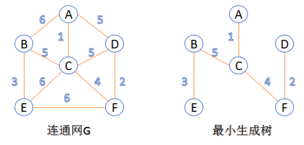
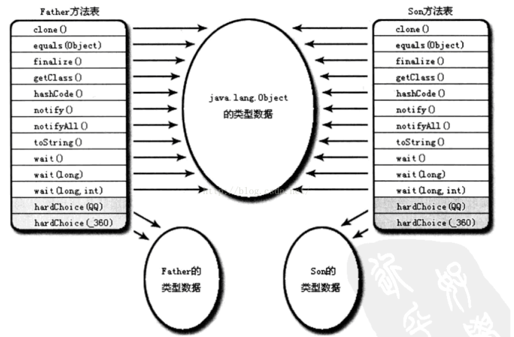

面向对象6大原则

- **开闭原则**：**对扩展开放,对修改关闭**，多使用抽象类和接口。
  - 比如代理模式，不修改原有的类，而是在基础上做扩展
- **里氏替换原则**：基类可以被子类替换，使用抽象类继承,不使用具体类继承。
  - **子类可以扩展父类的功能，但不能改变父类原有的功能。**
- 依赖倒转原则：要依赖于抽象,不要依赖于具体，针对接口编程,不针对实现编程。
- **接口隔离原则**：**使用多个隔离的接口,比使用单个接口好，建立最小的接口。**
- 迪米特法则：一个软件实体应当尽可能少地与其他实体发生相互作用，通过中间类建立联系。
- 合成复用原则：尽量使用合成/聚合,而不是使用继承。


- isHeldExclusively()：该线程是否正在独占资源。只有用到condition才需要去实现它。
- tryAcquire(int)：独占方式。尝试获取资源，成功则返回true，失败则返回false。
- tryRelease(int)：独占方式。尝试释放资源，成功则返回true，失败则返回false。
- tryAcquireShared(int)：共享方式。尝试获取资源。负数表示失败；0表示成功，但没有剩余可用资源；正数表示成功，且有剩余资源。
- tryReleaseShared(int)：共享方式。尝试释放资源，如果释放后允许唤醒后续等待结点返回true，否则返回false。

　　以ReentrantLock为例，state初始化为0，表示未锁定状态。A线程lock()时，会调用tryAcquire()独占该锁并将state+1。此后，其他线程再tryAcquire()时就会失败，直到A线程unlock()到state=0（即释放锁）为止，其它线程才有机会获取该锁。当然，释放锁之前，A线程自己是可以重复获取此锁的（state会累加），这就是可重入的概念。但要注意，获取多少次就要释放多么次，这样才能保证state是能回到零态的。


## 偏向锁/轻量级锁/重量级锁

这三种锁是指锁的状态，并且是针对`Synchronized`。在Java 5通过引入锁升级的机制来实现高效`Synchronized`。这三种锁的状态是通过对象监视器在对象头中的字段来表明的。
偏向锁是指一段同步代码一直被一个线程所访问，那么该线程会自动获取锁。降低获取锁的代价。
轻量级锁是指当锁是偏向锁的时候，被另一个线程所访问，偏向锁就会升级为轻量级锁，其他线程会通过自旋的形式尝试获取锁，不会阻塞，提高性能。
重量级锁是指当锁为轻量级锁的时候，另一个线程虽然是自旋，但自旋不会一直持续下去，当自旋一定次数的时候，还没有获取到锁，就会进入阻塞，该锁膨胀为重量级锁。重量级锁会让其他申请的线程进入阻塞，性能降低。


连接：mysql -h[10.92.162.45](/var/folders/rh/jgv9z9yj5g5860ss7tvyyjq40000gp/T/abnerworks.Typora/11AD66A3-D8C0-45F8-BB44-EF8BF44B2194/10.92.162.45) -P8309 -uroot -pcdn-testing\!\!\!

数据库：cdn_cboard和cdn_data


cdn_cboard：全量表表结构。

cdn_data：一堆带随机串的而且名字比较长的表（直接drop也可以没影响）不要，其它的都要。


只需要表结构，不需要数据。

比如用navicat等工具可以导出，可以直接生成个.sql文件。


```
{
  "K" : "NAVHT4PXWT8WQBL5",
  "P" : "Mac 10.13",
  "DI" : "NzA4MzUxZjkzYzRlMzgx"
}
```


```
Y2QicJyjIiXSMCPyrBHpcDJIoVFr9AFXszK9zuwvuEIaQKol/8pYc5mig+HX6T6VF4U6SnkaEcIUVZWkpoRAxrjoV/PqHNhbpnGbyh+pZ9wcdfkMDpQEBWqeIC9hIWaYGidF2RvLpHH3A9pdIe8colO8tNrRF312Q0czq5qHBAzR2k4py9telSi8gx8pH3NOYl3dP3MtuyANkKb6wwqx9/f5os38e2xHca4xjj5edVEuyXHvpog08oXV1HkqVwSQh7QFaIDy9dHs/1nnDiL24X75HoTPym0dsWKsT6trXNe0/psJk5GP4a+nD1MEVKQwMGYAszr4+wMtvs8iXqkSVA==
```


```
{"K":"NAVHT4PXWT8WQBL5", "N":"marswill", "O":"weiyongqiang.com", "DI":"ODQ2Yjg2ZDBjMTEzMjhh", "T":1516939200}
```


---


#### 最短路径 迪杰斯特拉算法


#### 最小生成树 Prim算法


- **连通图**：在无向图中，若任意两个顶点vivi与vjvj都有路径相通，则称该无向图为连通图。
- **强连通图**：在有向图中，若任意两个顶点vivi与vjvj都有路径相通，则称该有向图为强连通图。
- **连通网**：在连通图中，若图的边具有一定的意义，每一条边都对应着一个数，称为权；权代表着连接连个顶点的代价，称这种连通图叫做连通网。
- **生成树**：一个连通图的生成树是指一个连通子图，它含有图中全部n个顶点，但只有足以构成一棵树的n-1条边。一颗有n个顶点的生成树有且仅有n-1条边，如果生成树中再添加一条边，则必定成环。
- **最小生成树**：在连通网的所有生成树中，所有边的代价和最小的生成树，称为最小生成树。 


加权联通图中找到权值和最小的生成树





#### 拓扑排序

在图论中，拓扑排序（Topological Sorting）是一个有向无环图（DAG, Directed Acyclic Graph）的所有顶点的线性序列。且该序列必须满足下面两个条件：

每个顶点出现且只出现一次。
若存在一条从顶点 A 到顶点 B 的路径，那么在序列中顶点 A 出现在顶点 B 的前面。

1. 从 DAG 图中选择一个 没有前驱（即入度为0）的顶点并输出。
2. 从图中删除该顶点和所有以它为起点的有向边。
3. 重复 1 和 2 直到当前的 DAG 图为空或**当前图中不存在无前驱的顶点为止**。后一种情况说明有向图中必然存在环。


#### bitmap


#### 并查集

https://www.cnblogs.com/hapjin/p/5478352.html


TCP协议的RST

**RST表示复位，用来异常的关闭连接，在TCP的设计中它是不可或缺的。就像上面说的一样，发送RST包关闭连接时，不必等缓冲区的包都发出去（不像上面的FIN包），直接就丢弃缓存区的包发送RST包。而接收端收到RST包后，也不必发送ACK包来确认。**

TCP处理程序会在自己认为的异常时刻发送RST包。例如，**A向B发起连接，但B之上并未监听相应的端口，这时B操作系统上的TCP处理程序会发RST包。**

又比如，AB正常建立连接了，正在通讯时，A向B发送了FIN包要求关连接，B发送ACK后，网断了，A通过若干原因放弃了这个连接（例如进程重启）。网通了后，B又开始发数据包，A收到后表示压力很大，不知道这野连接哪来的，就发了个RST包强制把连接关了，B收到后会出现connect reset by peer错误。


#### 无锁队列

在并发编程中，我们可能经常需要用到线程安全的队列，java为此提供了两种模式的队列：阻塞队列和非阻塞队列。

> **注**：阻塞队列和非阻塞队列如何实现线程安全？
>
> - 阻塞队列可以用一个锁（入队和出队共享一把锁）或者两个锁（入队使用一把锁，出队使用一把锁）来实现线程安全，JDK中典型的实现是`BlockingQueue`；
> - 非阻塞队列可以用循环CAS的方式来保证数据的一致性，来达到线程安全的目的。


#### Redis String实现原理

String的数据类型是由SDS（Simple Dynamic String）实现的。Redis并没有采用C语言的字符串表示，而是自己构建了一种名为SDS的抽象类型，并将SDS作为Redis的默认字符串表示。

```cmd
redis>SET msg "hello world"
OK
```

上边设置key=msg，value=hello world的键值对，它们的底层存储是：键（key）是字符串类型，其底层实现是一个保存着“msg”的SDS。值（value）是字符串类型，其底层实现是一个保存着“hello world”的SDS。

> 注意：SDS除了用于实现字符串类型，还被用作AOF持久化时的缓冲区。

SDS的定义为：

```c
struct sdshdr {  

// buf 中已占用空间的长度  
int len;  

// buf 中剩余可用空间的长度  
int free;  

// 数据空间  
char buf[];  
};
```

##### 1. 直接获取字符串长度

时间复杂度：**获取字符串长度（SDS O（1））**

我们一定会思考，redis为什么不使用C语言的字符串而是费事搞一个SDS呢，这是因为C语言用N+1的字符数组来表示长度为N的字符串，这样做在获取字符串长度，字符串扩展等操作方面效率较低，并且无法满足redis对字符串在安全性、效率以及功能方面的要求。

**在C语言字符串中，为了获取一个字符串的长度，必须遍历整个字符串，时间复杂度为O(1)，而SDS中，有专门用于保存字符串长度的变量，所以可以在O（1）时间内获得。**

##### 2. 防止缓冲区溢出

C字符串，容易导致缓冲区溢出，假设在程序中存在内存紧邻的字符串s1和s2，s1保存redis，s2保存MongoDB，如下图：


如果我们现在将s1 的内容修改为redis cluster，但是又忘了重新为s1 分配足够的空间，这时候就会出现以下问题：


因为s1和s2是紧邻的，所以原本s2 中的内容已经被S1的内容给占领了，s2 现在为 cluster，而不是“Mongodb”。而Redis中的SDS就杜绝了发生缓冲区溢出的可能性。当我们需要对一个SDS 进行修改的时候，redis 会在执行拼接操作之前，预先检查给定SDS 空间是否足够（free记录了剩余可用的数据长度），如果不够，会先拓展SDS 的空间，然后再执行拼接操作。

##### 3. 减少扩展或收缩字符串带来的内存重分配次数

当字符串进行扩展或收缩时，都会对内存空间进行重新分配。

　1. 字符串拼接会产生字符串的内存空间的扩充，在拼接的过程中，原来的字符串的大小很可能小于拼接后的字符串的大小，那么这样的话，就会导致一旦忘记申请分配空间，就会导致内存的溢出。

　2. 字符串在进行收缩的时候，内存空间会相应的收缩，而如果在进行字符串的切割的时候，没有对内存的空间进行一个重新分配，那么这部分多出来的空间就成为了内存泄露。

比如：字符串"redis"，当进行字符串拼接时，将redis+cluster=13，会将SDS的长度修改为13，同时将free也改为13，这意味着进行预分配了，将buffer大小变为了26。这是为了如果再次执行字符串拼接操作，如果拼接的字符串长度<13,就不需要重新进行内存分配了。

通过这种预分配策略，SDS将连续增长N次字符串所需的内存重分配次数从必定N次降低为最多N次。通过惰性空间释放，SDS 避免了缩短字符串时所需的内存重分配操作，并未将来可能有的增长操作提供了优化。

##### 4. 二进制安全

C 字符串中的字符必须符合某种编码，并且除了字符串的末尾之外，字符串里面不能包含空字符，否则最先被程序读入的空字符将被误认为是字符串结尾，这些限制使得C字符串只能保存文本数据，而不能保存想图片，音频，视频，压缩文件这样的二进制数据。

但是在Redis中，不是靠空字符来判断字符串的结束的，而是通过len这个属性。那么，即便是中间出现了空字符对于SDS来说，读取该字符仍然是可以的。但是，SDS依然可以兼容部分C字符串函数。


####  线程池

##### 1. 为什么要设置核心线程数和最大线程数

当提交一个新任务到线程池时 首先线程池判断基本线程池(corePoolSize)是否已满？没满，创建一个工作线程来执行任务。满了，则进入下个流程； 其次线程池判断工作队列(workQueue)是否已满？没满，则将新提交的任务存储在工作队列里。满了，则进入下个流程； 最后线程池判断整个线程池(maximumPoolSize)是否已满？没满，则创建一个新的工作线程来执行任务，满了，则交给饱和策略来处理这个任务； **如果线程池中的线程数量大于 corePoolSize 时，如果某线程空闲时间超过 keepAliveTime，线程将被终止，直至线程池中的线程数目不大于 corePoolSize**；如果允许为核心池中的线程设置存活时间，那么核心池中的线程空闲时间超过 keepAliveTime，线程也会被终止。

这么比喻吧，核心线程数就像是工厂正式工，最大线程数，就是工厂临时工作量加大，请了一批临时工，临时工加正式工的和就是最大线程数，等这批任务结束后，临时工要辞退的，而正式工会留下。


#### TreeMap和HashMap有什么区别

使用Iterator迭代器遍历的时候，HashMap的结果是没有排序的，而TreeMap输出的结果是排好序的。

```java
Iterator<String> iter = map.iterator();
hasNext()
next()
```


#### 静态分派和动态分派

##### 静态分派

```java
public class StaticDispatch {
	static abstract class Human{
	}
	static class Man extends Human{
	}
	static class Woman extends Human{
	}
	public static void sayHello(Human guy){
		System.out.println("hello,guy!");
	}
	public static void sayHello(Man guy){
		System.out.println("hello,gentlemen!");
	}
	public static void sayHello(Woman guy){
		System.out.println("hello,lady!");
	}
	
	public static void main(String[] args) {
		Human man=new Man();
		Human woman=new Woman();
		sayHello(man);   //输出hello,guy
		sayHello(woman); //输出hello,guy
	}
}
```

- 重载：方法名相同，参数列表不同
- 编译器在***重载***时是通过***参数的静态类型***而不是实际类型作为判定的依据。并且静态类型在编译期可知，因此，编译阶段，Javac编译器会根据**参数的静态类型**决定使用哪个重载版本。

##### 动态分派

```java
public class DynamicDispatch {
	static abstract class Human{
		protected abstract void sayHello();
	}
	static class Man extends Human{ 
		@Override
		protected void sayHello() { 
			System.out.println("man say hello!");
		}
	}
	static class Woman extends Human{ 
		@Override
		protected void sayHello() { 
			System.out.println("woman say hello!");
		}
	} 
	public static void main(String[] args) {
		
		Human man=new Man(); 
		Human woman=new Woman();
		man.sayHello();   //输出 man say hello
		woman.sayHello(); //输出 woman say hello
    
		man=new Woman();
		man.sayHello(); 
	}
}
```

显然，这里不可能再根据静态类型来决定，因为静态类型同样是Human的两个变量man和woman在调用sayHello()方法时执行了不同的行为，并且变量man在两次调用中执行了不同的方法。导致这个现象的原因很明显，是这两个变量的实际类型不同，Java虚拟机是如何根据实际类型来分派方法执行版本的呢？
我们从invokevirtual指令的多态查找过程开始说起，invokevirtual指令的运行时解析过程大致分为以下几个步骤：

1、找到操作数栈顶的第一个元素所指向的对象的实际类型，记作C。
2、如果在类型C中找到与常量中的描述符和简单名称相符合的方法，然后进行访问权限验证，如果验证通过则返回这个方法的直接引用，查找过程结束；如果验证不通过，则抛出java.lang.IllegalAccessError异常。
3、否则未找到，就按照继承关系从下往上依次对类型C的各个父类进行第2步的搜索和验证过程。
4、如果始终没有找到合适的方法，则跑出java.lang.AbstractMethodError异常。

**由于invokevirtual指令执行的第一步就是在运行期确定接收者的实际类型，所以两次调用中的invokevirtual指令把常量池中的类方法符号引用解析到了不同的直接引用上，这个过程就是Java语言方法重写的本质。**我们把这种在运行期根据实际类型确定方法执行版本的分派过程称为动态分派。


JVM虚拟机是如何实现动态分派的？




虚方法表中存放着各个方法的实际入口地址。如果某个方法在子类中没有被重写，那子类的虚方法表里面的地址入口和父类相同方法的地址入口是一致的，都是指向父类的实际入口。如果子类中重写了这个方法，子类方法表中的地址将会替换为指向子类实际版本的入口地址。

为了程序实现上的方便，具有相同签名的方法，在父类、子类的虚方法表中具有一样的索引序号，这样当类型变换时，仅仅需要变更查找的方法表，就可以从不同的虚方法表中按索引转换出所需要的入口地址。

方法表一般在类加载阶段的连接阶段进行初始化，准备了类的变量初始值后，虚拟机会把该类的方法表也初始化完毕。


#### MySQL默认事务隔离-可重复读 实现原理

MySQL通过MVCC(multi version concurrent control)来实现默认的"Repeatable Read"事务隔离级别

```
InnoDB在每行记录后面保存两个隐藏的列来，分别保存了这个行的创建时间和行的删除时间。这里存储的并不是实际的时间值,而是系统版本号，当数据被修改时，版本号加1。在读取事务开始时，系统会给当前读事务一个版本号，事务会读取版本号<=当前版本号的数据。此时如果其他写事务修改了这条数据，那么这条数据的版本号就会加1，从而比当前读事务的版本号高，读事务自然而然的就读不到更新后的数据了。
```

举个栗子，假设初始版本号为1：

**INSERT**

```
insert into user (id,name) values (1,'Tom');
```

|  id  | name | create_version | delete_version |
| :--: | :--: | :------------: | :------------: |
|  1   | Tom  |       1        |                |

下面模拟一下文章开头的场景：

**SELECT (事务A)**

```
select * from user where id = 1;
```

此时读到的版本号为1，值为"Tom"

**UPDATE(事务B)**

```
update user set name = 'Jerry' where id = 1;
```

在更新操作的时候，该事务的版本号在原来的基础上加1，所以版本号为2。 
先将要更新的这条数据标记为已删除，并且删除的版本号是当前事务的版本号，然后插入一行新的记录

|  id  | name  | create_version | delete_version |
| :--: | :---: | :------------: | :------------: |
|  1   |  Tom  |       1        |       2        |
|  1   | Jerry |       2        |                |

**SELECT (事务A)**

此时事务A再重新读数据：

```
select * from user where id = 1;
```

由于事务A一直没提交，所以此时读到的版本号还是为1，所以读到的还是Tom这条数据，也就是可重复读。


#### 生产者-消费者模型


#### 二叉树遍历の非递归写法

##### 前序遍历

```java
//1. 递归
private static List<Integer> res;
public void PreOrder(TreeNode root){
	if(root != null){ //递归终止条件
		res.add(root.val);
		PreOrder(root.left); //类似入栈
		preOrder(root.right);
	}
	//程序自动出栈
}

//2. 非递归
public void PreOrder(TreeNode root){
	List<Integer> res = new ArrayList<>();
	Stack<TreeNode> stack = new Stack<>();
	TreeNode cur = root;

	while(cur != null || !stack.isEmpty()){
		while(cur != null){
			stack.push(cur);
			res.add(cur.val);
			cur = cur.left;
		}
		//这里cur = null，等同于递归终止条件
		cur = stack.pop(); //刚pop的元素已经使用过了，
		cur = cur.right;  //所以需要cur.right
	}
}
```


##### 中序遍历

```java
pubilc void InOrder(TreeNode root){
	List<Integer> res = new ArrayList<>();
	Stack<TreeNode> stack = new Stack<>();

	TreeNode cur = root;
	while(cur != null || !stack.isEmpty()){
		if(cur != null){
			stack.push(cur);
			cur = cur.left;
		}
		cur = stack.pop();
		res.add(cur.val); //在这里才访问节点
		cur = cur.right; 
	}
}
```


##### 后序遍历

```java

```


#### JDK 1.8 concurrenthashmap优化

https://blog.csdn.net/u011116672/article/details/88787292


https://www.nowcoder.com/search?type=post&query=%E7%8C%BF%E8%BE%85%E5%AF%BC+%E9%9D%A2%E7%BB%8F


