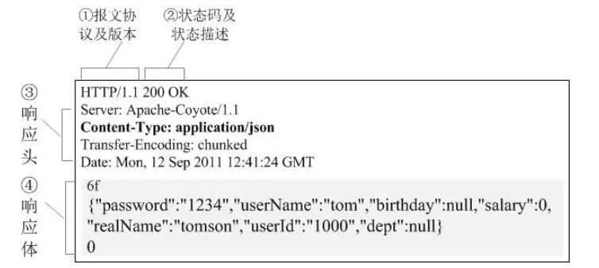

https://wizardforcel.gitbooks.io/network-basic/0.html 计算机网络基本功


tcp滑动窗口

TCP详解文章：http://www.52im.net/thread-515-1-1.html

- 滑动窗口是为了解决什么问题？
  - 

***TCP的滑动窗口主要有两个作用，一是提供TCP的可靠性，二是提供TCP的流控特性。***同时滑动窗口机制还体现了TCP面向字节流的设计思路。

TCP的Window是一个16bit位字段，它代表的是窗口的字节容量，也就是TCP的标准窗口最大为2^16-1=65535个字节。

TCP是全双工协议，发送的一方同时也是接受的一方，所以滑动窗口分为发送窗口和接受窗口

```
对于TCP会话的发送方，任何时候在其发送缓存内的数据都可以分为4类，“已经发送并得到对端ACK的”，“已经发送但还未收到对端ACK的”，“未发送但对端允许发送的”，“未发送且对端不允许发送”。“已经发送但还未收到对端ACK的”和“未发送但对端允许发送的”这两部分数据称之为发送窗口（中间两部分）。
```


```
对于TCP的接收方，在某一时刻在它的接收缓存内存在3种。“已接收”，“未接收准备接收”，“未接收并未准备接收”（由于ACK直接由TCP协议栈回复，默认无应用延迟，不存在“已接收未回复ACK”）。其中“未接收准备接收”称之为接收窗口。
```

最基本的传输可靠性来源于“确认重传”机制。

***TCP的滑动窗口的可靠性也是建立在“确认重传”基础上的。***

发送窗口只有收到对端对于本段发送窗口内字节的ACK确认，才会移动发送窗口的左边界。

***接收窗口只有在前面所有的段都确认的情况下才会移动左边界。***当在前面还有字节未接收但收到后面字节的情况下，窗口不会移动，并不对后续字节确认。以此确保对端会对这些数据重传。


tcp流量控制

- 为什么需要流量控制
  - 


tcp拥塞控制

- 为什么需要拥塞控制
  - `TCP`作为一个端到端的传输层协议，它并不关心连接双方在物理链路上会经过多少路由器交换机以及报文传输的路径和下一条，这是`IP`层该考虑的事。
  - 在现实网络应用中，`TCP`连接的两端可能相隔千山万水，报文也需要由多个路由器交换机进行转发**, 当多个入接口的报文都要从相同的出接口转发时，如果出接口转发速率达到极限，报文就会开始在交换设备的入接口缓存队列堆积**，当队列塞满后，后续输入的报文就只能被丢弃掉了。对于`TCP`的发送端来说，看到的就是发送超时丢包了。

- 拥塞控制算法
  - 参考：https://segmentfault.com/a/1190000019102072
  - 慢启动：Tahoe`需要为选定一个`cwnd`初始值，但是发送端并不知道多大的`cwnd`才合适。所以只能从**1**开始`4`，如果这个时候就开始加性增，那就太慢了，比如假设一个连接会发送**5050**个`MSS`大小的报文，按照加性增加，需要**100**个`RTT`才能传输完成(1+2+3+...+100=5050)。因此，`Tahoe`和`Reno`使用一种称为慢启动的算法迅速提高`cwnd`。也就是只要没有丢包，每发送一个整窗的数据，`cwnd = 2 X cwnd`。换句话说，在`慢启动阶段`(`slow-start phase`)，当发送端每收到一个`ACK`时，就让`cwnd = cwnd * 2
  - 快速重传：设置`ssthresh = cwnd / 2 `, `cwnd = 1`.
  - 快速恢复：在快速重传中，当出现报文乱序丢包后，拥塞窗口`cwnd`变为**1**，由于该限制，在丢失的数据包被应答之前，没有办法发送新的数据包。这样大大降低了网络的吞吐量。


tar -tvf extundelete-0.2.4.tar.bz2 