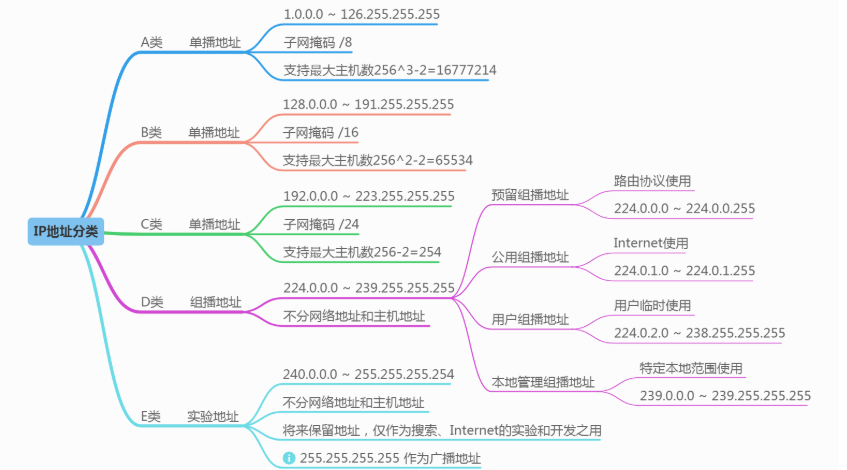
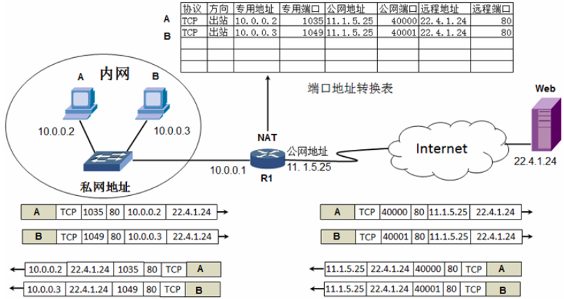

https://bjango.com/mac/istatmenus/

```
Email: 982092332@qq.com 
SN: GAWAE-FCWQ3-P8NYB-C7GF7-NEDRT-Q5DTB-MFZG6-6NEQC-CRMUD-8MZ2K-66SRB-SU8EW-EDLZ9-TGH3S-8SGA 
```


Wireshark-Mac安装


Charles-Mac安装


DNS递归解析过程

1. 查询LocalDNS
2. 查询根域名服务器(.)，得到顶级域名服务器地址
3. 查询顶级域名服务器(.com)，得到二级域名服务器地址
4. 查询二级域名服务器(baidu.com)，得到权威服务器地址
5. 查询权威服务器(www.baidu.com)，得到IP地址


TCP为什么不能是两次握手？

谢希仁版《计算机网络》中的例子是这样的，“已失效的连接请求报文段”的产生在这样一种情况下：client发出的第一个连接请求报文段并没有丢失，而是在某个网络结点长时间的滞留了，以致延误到连接释放以后的某个时间才到达server。本来这是一个早已失效的报文段。但server收到此失效的连接请求报文段后，就误认为是client再次发出的一个新的连接请求。于是就向client发出确认报文段，同意建立连接。假设不采用“三次握手”，那么只要server发出确认，新的连接就建立了。由于现在client并没有发出建立连接的请求，因此不会理睬server的确认，也不会向server发送数据。但server却以为新的运输连接已经建立，并一直等待client发来数据。这样，server的很多资源就白白浪费掉了。采用“三次握手”的办法可以防止上述现象发生。例如刚才那种情况，client不会向server的确认发出确认。server由于收不到确认，就知道client并没有要求建立连接。”


TCP滑动窗口？

https://juejin.im/post/5ba895a06fb9a05ce95c5dac


TCP超时重传？


TCP拥塞原理？


IP地址如何划分？




IP公网地址和私网地址?

**公网IP地址**
公有地址分配和管理由Inter NIC（Internet Network Information Center 因特网信息中心）负责。各级ISP使用的公网地址都需要向Inter NIC提出申请，有Inter NIC统一发放，这样就能确保地址块不冲突。

**私网IP地址**
创建IP寻址方案的人也创建了私网IP地址。这些地址可以被用于私有网络，在Internet没有这些IP地址，Internet上的路由器也没有到私有网络的路由表。

- A类：10.0.0.0 255.0.0.0，保留了1个A类网络。
- B类：172.16.0.0 255.255.0.0～172.31.0.0 255.255.0.0，保留了16个B类网络。
- C类：192.168.0.0 255.255.255.0～192.168.255.0 255.255.255.0，保留了256个C类网络。

PS：私网地址访问Internet需要做NAT或PAT网络地址转换




NAT是什么？


NAT是 Network Address Translation 网络地址转换的缩写。 
NAT是将私有IP地址通过边界路由转换成外网IP地址，在边界路由的NAT地址转换表记录下这个转换映射记录，当外部数据返回时，路由使用NAT技术查询NAT转换表，再将目标地址替换成内网用户IP地址。 

**PAT(port address Translation，端口地址转换，也叫端口地址复用)**

这是最常用的NAT技术，也是IPv4能够维持到今天的最重要的原因之一，它提供了一种多对一的方式，对多个内网IP地址，边界路由可以给他们分配一个外网IP，利用这个外网IP的不同端口和外部进行通信。 


子网掩码是什么？有什么用？

**二、** **为什么需要使用子网掩码**  

虽然我们说子网掩码可以分离出 *IP* 地址中的网络部分与主机部分，可大家还是会有疑问，比如为什么要区分网络地址与主机地址？区分以后又怎样呢？那么好，让我们再详细的讲一下吧！  

在使用 *TCP/IP* 协议的两台计算机之间进行通信时，我们通过将本机的子网掩码与接受方主机的 *IP* 地址进行 *'* 与 *'* 运算，即可得到目标主机所在的网络号，又由于每台主机在配置 *TCP/IP* 协议时都设置了一个本机 *IP* 地址与子网掩码，所以可以知道本机所在的网络号。

通过比较这两个网络号，就可以知道接受方主机是否在本网络上。如果网络号相同，表明接受方在本网络上，那么可以通过相关的协议把数据包直接发送到目标主机；如果网络号不同，表明目标主机在远程网络上，那么数据包将会发送给本网络上的路由器，由路由器将数据包发送到其他网络，直至到达目的地。在这个过程中你可以看到，子网掩码是不可或缺的！

**计算方式**

过程如下：

*1.* 将 *IP* 地址与子网掩码转换成二进制；

*2.* 将二进制形式的 *IP* 地址与子网掩码做 *'* 与 *'* 运算，将答案化为十进制便得到网络地址；

*3.* 将二进制形式的子网掩码取 *'* 反 *'* ；

*4.* 将取 *'* 反 *'* 后的子网掩码与 *IP* 地址做 *'* 与 *'* 运算，将答案化为十进制便得到主机地址。

下面我们用一个例子给大家演示：

假设有一个 *I P* 地址： *192.168.0.1*

子网掩码为： *255.255.255.0*

化为二进制为： *I P* 地址 *11000000.10101000.00000000.00000001*

子网掩码 *11111111.11111111.11111111.00000000*

将两者做 *'* 与 *'* 运算得： *11000000.10101000.00000000.00000000*

将其化为十进制得： *192.168.0.0*

这便是上面 *IP* 的网络地址，主机地址以此类推。

**小技巧：由于观察到上面的子网掩码为 C** **类地址的默认子网掩码（至于为什么，可看后面的子网掩码分类就明白了），便可直接看出网络地址为 IP** **地址的前三部分，即前三个字节，主机地址为最后一部分。**


协程是什么？

**协程，英文Coroutines，是一种比线程更加轻量级的存在。**正如一个进程可以拥有多个线程一样，一个线程也可以拥有多个协程。

最重要的是，协程不是被操作系统内核所管理，而完全是由程序所控制（也就是在用户态执行）。

这样带来的好处就是性能得到了很大的提升，不会像线程切换那样消耗资源。

由于Java的原生语法中并没有实现协程。


```
正整数开平方根

```


评估表—模拟：

http://wiki.baidu.com/pages/viewpage.action?pageId=809898263&preview=/809898263/817507067/%E9%99%88%E4%BF%8A%E5%B3%B0-%E9%9D%A2%E8%AF%95%E8%AF%84%E4%BC%B0%E8%A1%A8.docx

```
OpenCDN-API有什么用
OpenCDN-API在整个系统中的作用


```

https://duguanjia.baidu.com/?fileCode=null#/


