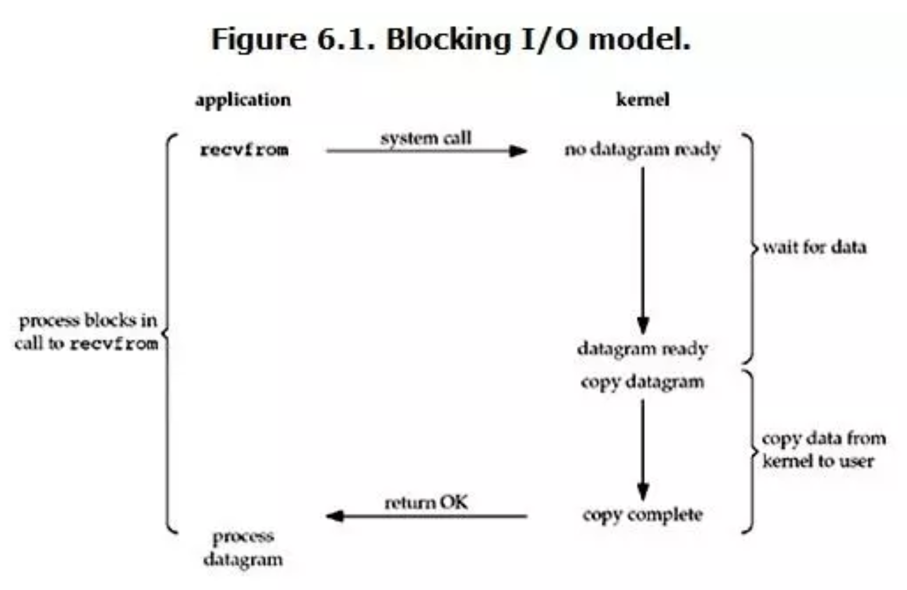
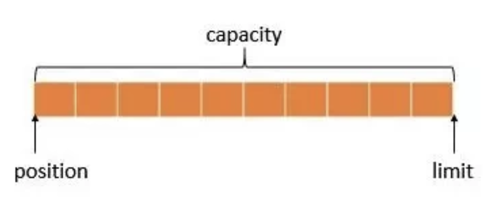

#### 左连接和右连接

```mysql
DROP TABLE `a_table`;
DROP TABLE `b_table`;

CREATE TABLE `a_table` (
  `a_id` int(11) PRIMARY KEY AUTO_INCREMENT,
  `a_name` varchar(10) DEFAULT NULL,
  `a_part` varchar(10) DEFAULT NULL
) ENGINE=InnoDB DEFAULT CHARSET=utf8;

CREATE TABLE `b_table` (
  `b_id` int(11) PRIMARY KEY AUTO_INCREMENT,
  `b_name` varchar(10) DEFAULT NULL,
  `b_part` varchar(10) DEFAULT NULL
) ENGINE=InnoDB DEFAULT CHARSET=utf8;

insert into a_table (a_name,a_part) values ('a1','ap1');
insert into a_table (a_name,a_part) values ('a2','ap2');
insert into a_table (a_name,a_part) values ('a3','ap3');

insert into b_table (b_name,b_part) values ('a1','ap1');
insert into b_table (b_name,b_part) values ('a2','ap2');
insert into b_table (b_name,b_part) values ('b3','bp3');
```

- 内连接
  - `select * from A INNER JOIN B ON 条件`
  - 返回两个集合交集的部分
  - 
- 左连接
  - `select * from A left join B on 条件`
  - 左表会显示全部元素，右表会显示符合条件的部分+其他不符合条件的部分[NULL表示]
  - 

- 右连接
  - `select * from A right join B on 条件`
  - 右表会显示全部，左表会显示符合提交的部分+其他不符合条件的部分[NULL表示]
  - 


####  auto_increment为什么必须要配合key使用


## IO复用技术

全面总结：http://www.jasongj.com/java/nio_reactor/

#### NIO

##### 0. 阻塞/非阻塞和异步/同步的区别

- 同步和异步着重点在于多个任务执行过程中，**后发起的任务是否必须等先发起的任务完成之后再进行。**而不管先发起的任务请求是阻塞等待完成，还是立即返回通过循环等待请求成功。

- 而阻塞和非阻塞重点在于**请求的方法是否立即返回**（或者说是否在条件不满足时被阻塞）。

##### 1.  Unix IO模型

Unix 下共有五种 I/O 模型：

- **阻塞 I/O**
- **非阻塞 I/O**
- **I/O 多路复用（select和poll）**
- 信号驱动 I/O（SIGIO）
- 异步 I/O（Posix.1的aio_系列函数）




当用户进程调用了recvfrom这个系统调用，kernel就开始了IO的第一个阶段：准备数据。对于network io来说，很多时候数据在一开始还没有到达（比如，还没有收到一个完整的UDP包），这个时候kernel就要等待足够的数据到来。而在用户进程这边，整个进程会被阻塞。当kernel一直等到数据准备好了，它就会将数据从kernel中拷贝到用户内存，然后kernel返回结果，用户进程才解除block的状态，重新运行起来。**所以，blocking IO的特点就是在IO执行的两个阶段都被block了。**


从图中可以看出，当用户进程发出read操作时，如果kernel中的数据还没有准备好，那么它并不会block用户进程，而是立刻返回一个error。从用户进程角度讲 ，它发起一个read操作后，并不需要等待，而是马上就得到了一个结果。用户进程判断结果是一个error时，它就知道数据还没有准备好，于是它可以再次发送read操作。**一旦kernel中的数据准备好了，并且又再次收到了用户进程的system call，那么它马上就将数据拷贝到了用户内存，然后返回。所以，用户进程其实是需要不断的主动询问kernel数据好了没有。**


当用户进程调用了select，那么整个进程会被block，而同时，kernel会“监视”所有select负责的socket，当任何一个socket中的数据准备好了，select就会返回。这个时候用户进程再调用read操作，将数据从kernel拷贝到用户进程。

这个图和blocking IO的图其实并没有太大的不同，事实上，还更差一些。因为这里需要使用两个system call (select 和 recvfrom)，而blocking IO只调用了一个system call (recvfrom)。但是，用select的优势在于它可以同时处理多个connection。（多说一句。所以，如果处理的连接数不是很高的话，使用select/epoll的web server不一定比使用multi-threading + blocking IO的web server性能更好，可能延迟还更大。select/epoll的优势并不是对于单个连接能处理得更快，而是在于能处理更多的连接。）

在IO multiplexing Model中，**实际中，对于每一个socket，一般都设置成为non-blocking，**但是，如上图所示，整个用户的process其实是一直被block的。**只不过process是被select这个函数block，而不是被socket IO给block。**

##### 1. 什么是NIO，为了解决什么问题

参考：https://segmentfault.com/a/1190000017040893

- Java IO是面向流的，每次从流（InputStream/OutputStream）中读一个或多个字节，直到读取完所有字节，它们没有被缓存在任何地方。另外，它不能前后移动流中的数据，如需前后移动处理，需要先将其缓存至一个缓冲区。
- Java NIO面向缓冲，数据会被读取到一个缓冲区，**需要时可以在缓冲区中前后移动处理，这增加了处理过程的灵活性。**但与此同时在处理缓冲区前需要检查该缓冲区中是否包含有所需要处理的数据，并需要确保更多数据读入缓冲区时，不会覆盖缓冲区内尚未处理的数据。

##### 2. NIO组成

###### 1. Buffer



在对Buffer进行读/写的过程中，position会往后移动，而 limit 就是 position 移动的边界。由此不难想象，在对**Buffer进行写入操作时，limit应当设置为capacity的大小，而对Buffer进行读取操作时，limit应当设置为数据的实际结束位置。**（注意：将Buffer数据 写入 通道是Buffer 读取 操作，从通道 读取 数据到Buffer是Buffer 写入 操作）

###### 2. Channel


###### 3. Selector

- 为什么要使用Selector
  - 前文说了，如果用阻塞I/O，需要多线程（浪费内存），如果用非阻塞I/O，需要不断重试（耗费CPU）。Selector的出现解决了这尴尬的问题，非阻塞模式下，通过Selector，我们的线程只为已就绪的通道工作，不用盲目的重试了。比如，当所有通道都没有数据到达时，也就没有Read事件发生，我们的线程会在select()方法处被挂起，从而让出了CPU资源。


## Spring 事务管理


### ping的原理


交换机和路由器的区别？


